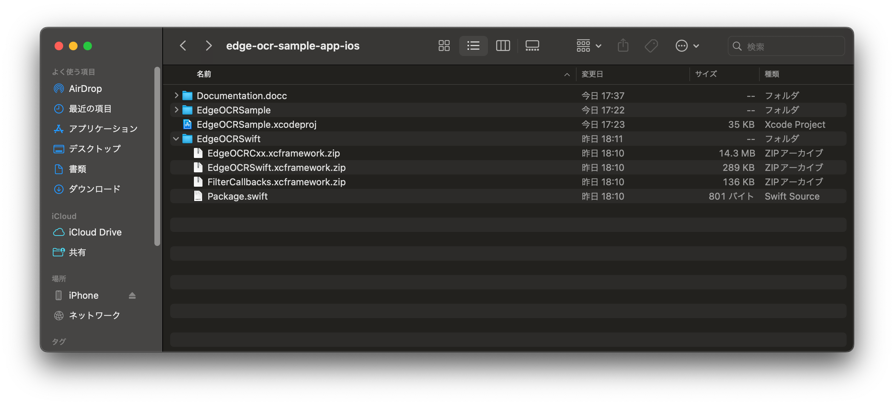
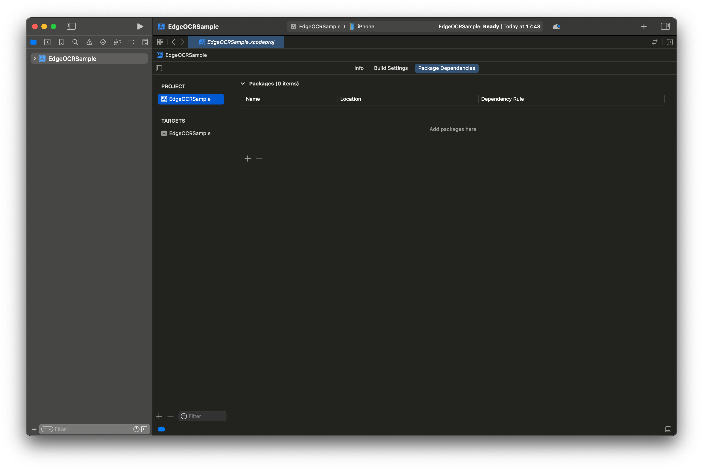
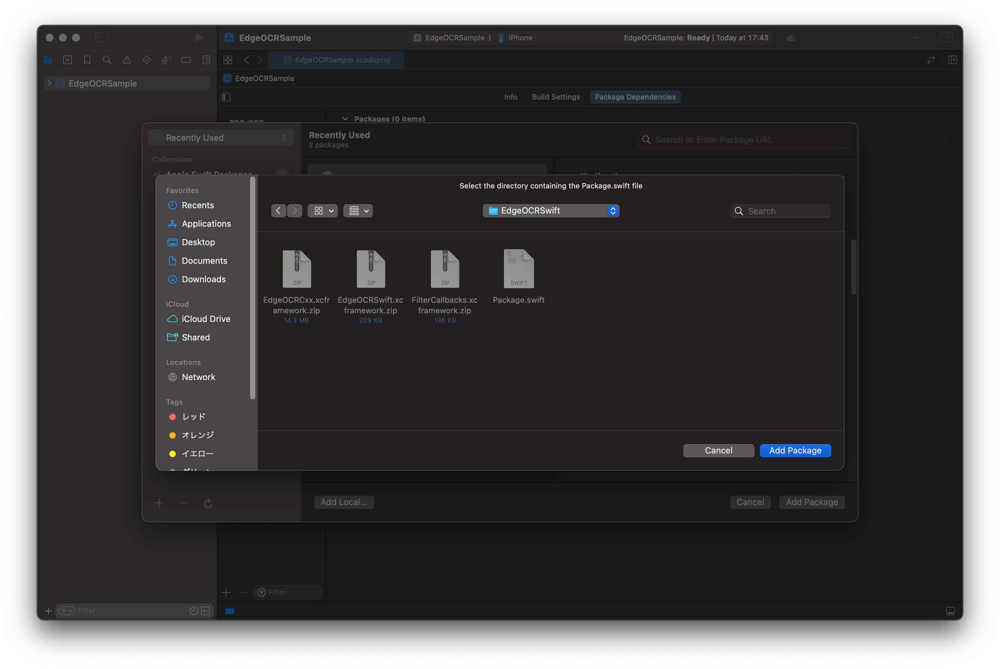
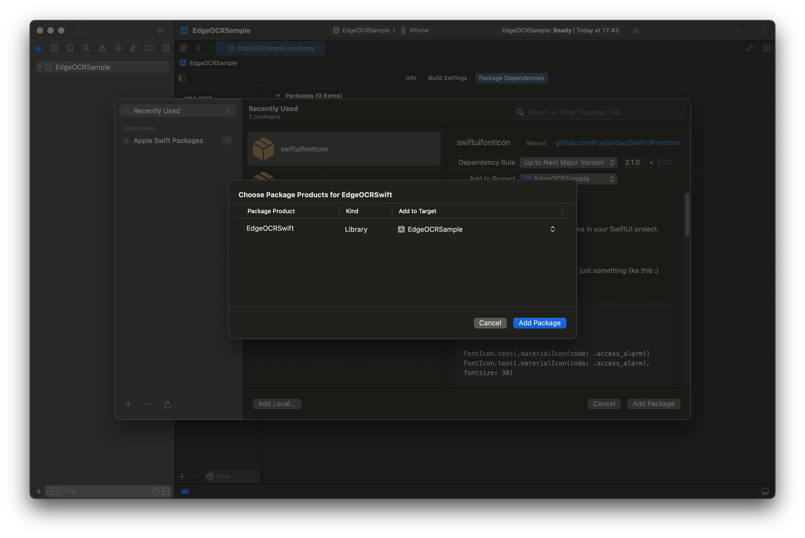
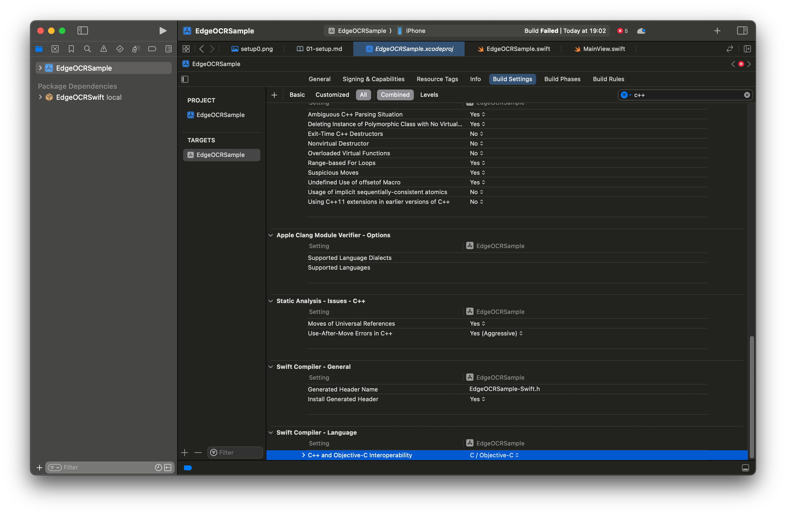

# EdgeOCRSample
EdgeOCRSwift SDK のチュートリアルリポジトリです．

## 概要
EdgeOCRSwift SDK（以下 SDK）の使い方をサンプルコードを交えて説明します. 
サンプルコードは、EdgeOCRSample ディレクトリに含まれています。

チュートリアルでは Xcode を用いての開発を想定しています.

まず環境の構築方法・デバイスのアクティベーション方法を説明し、そのあとに簡単な例から順を追って説明します。

## 環境構築
本レポジトリーのサンプルアプリをビルドするには、SDK とモデルファイルをダウンロードする必要があります．
なお、SDK のバージョンと本サンプルアプリが想定する SDK のバージョンが一致している必要があります．
本レポジトリーの git tag と SDK のバージョンは一致していますので、git tag を確認してください．

### EdgeOCRSwift SDKの追加方法
1. SDK の zip ファイルを本レポジトリーのルートディレクトリーに配置し、解凍してください．(以下の画像を参照) 

1. Xcode で Package Dependencies タブを開いてください．（以下の画像を参照）  
`EdgeOCRSsample > Package Dependencies`と選択することで，開くことができます．

1. Xcodeで Swift Package 選択画面で解凍した SDKを選択してください．（以下の画像を参照）  
`+` をクリックすることで，Swift Package 選択画面を開くことができます．

1. Xcodeで選択した EdgeOCRSwift SDK をプロジェクトに追加してください．（以下の画像を参照）

### モデルファイルの追加方法
ダウンロードしたモデルファイルは解凍し，Xcode上から `EdgeOCRSample > Add Files to "EdgeOCRSample"` でプロジェクトに追加してください．

### C++/Swift 相互運用の有効化
`EdgeOCRSample > Build Settings > Swift Compiler - Language > C++ and Objective-C Interoperability` の項目を `C++/Objective-C++` に変更してください．（以下の画像を参照） 

ここまで，完了したら Xcode でビルドしてみてください．
