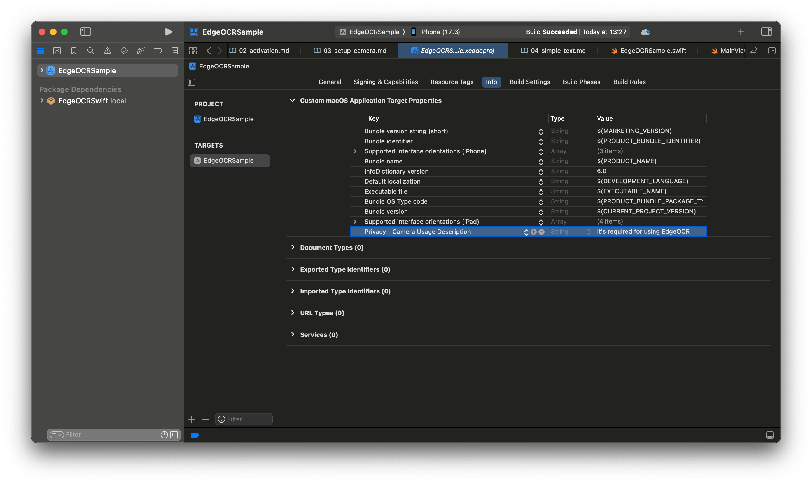

# カメラの設定
このチュートリアルではカメラ設定の注意点を説明します．


## 概要
まず，カメラをアプリで使用するために， `Info.plist` にカメラの使用用途を明記する必要があります．
次に，カメラ出力のピクセルフォーマットの設定では，`kCMPixelFormat_32BGRA` を必ず使用してください．
SDK の入力は， `kCMPixelFormat_32BGRA` を仮定して実装されています．
カメラ設定の実装は `EdgeOCRSample/Common/ViewController.swift` に実装されていますので，ご参考になさってください．


## **Info.plist** へのカメラの使用用途の明記方法
`EdgeOCRSample > Info > Custom macOS Application Target Properties` で
`Key` を `Privacy - Camera Usage Description`， `Value` に適切な使用用途を記述してください．



## カメラ出力の実装方法
カメラ出力のピクセルフォーマットは以下のように，`kCMPixelFormat_32BGRA` を必ず指定してください．
これは `ViewController` クラスの `ViewController/setupCaptureSession()` メソッドに記述されています．
```swift
func setupCaptureSession() {
    ...

    // MARK: - カメラ出力のピクセルフォーマットで `kCMPixelFormat_32BGRA` を指定
    videoOutput.videoSettings = [String(kCVPixelBufferPixelFormatTypeKey): kCMPixelFormat_32BGRA]
    videoOutput.connection(with: .video)?.videoRotationAngle = 90.0

    ...
}
```

カメラ設定の実装の詳細は `EdgeOCRSample/Common/ViewController.swift` に実装されていますので，ご参考になさってください．


## 次のステップ
次は最もシンプルなEdgeOCRSwiftの使用方法を説明します．

↪️ [最もシンプルな例](05-simple-text.md)
