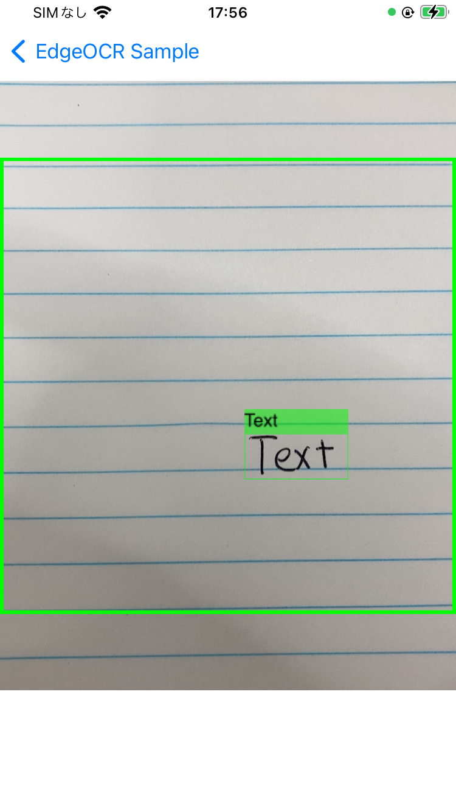
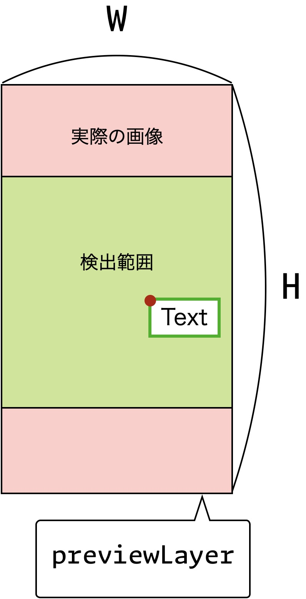
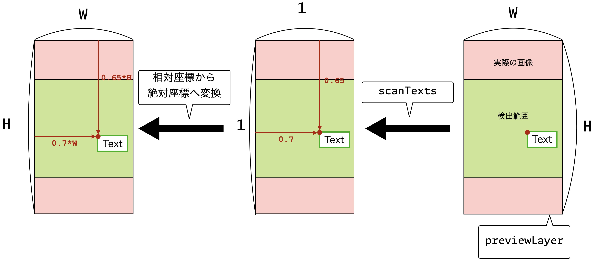

#  OCR結果を画面に表示する

このチュートリアルでは，OCR結果を画面に表示する方法を説明いたします．


## 概要
このチュートリアルでは，SDKを用いて検出・認識した結果の位置と文字を画面に表示する方法を説明いたします．
完成画面イメージは以下です．



こちらのサンプルでは[「もっともシンプルな例」](simple-text.md)に加えて次の 2 つのことを行っています．

- SDK のスキャン範囲外の画面をホワイトアウトする
- OCR 結果を画面上に表示する

この例の実装は 
`EdgeOCRSample/BoxesOverlay/BoxesOverlayViewController.swift` と 
`EdgeOCRSample/BoxesOverlay/BoxesOverlayView.swift` 
に実装されていますので，ご参考になさってください．


## SDK が解析する画像の範囲について
実装方法について説明を行う前に，SDK が解析する画像の範囲と検出結果の相対座標について説明を行います．

まず，`edgeOCR.scanTexts` が解析する範囲は，指定したモデルに依存します．
ここではデフォルトで提供されている `model-large` を例に説明を行っていきます．

モデルはインプットとして取れる画像のアスペクト比を持っており，
`model-d320x320` では`320x320（width x height）` のアスペクト比の画像をインプットの画像として受け取ることを想定しています．

インプットの画像として，モデルが想定しているアスペクト比とは異なる画像が渡された場合は，SDK は画像をそのアスペクト比になるように，画像の一部（デフォルトの場合は中心部分）を切り取った後，モデルに渡します．

下記の画像のように，横幅はインプット画像の幅を基準としてモデルのアスペクト比を保つように縦幅を算出します．




たとえば SDK に入力する画像のサイズを 360x720 とすると，モデルに渡される画像の大きさは，横幅はそのままの 360 で，縦幅が 360x320/320=90 となります．

次に，`edgeOCR.scanTexts` の検出結果を表す `Detection<Text>` の `getBoundingBox`メソッドで得られる座標は切り取った長方形の横・縦を1に正規化した相対座標で表されます．
先ほどの，`model-d320x320` を使用した際の，検出結果の `detectionLayer` における絶対座標の計算方法を以下の図を用いて説明いたします．
まず，`previewLayer` に写る `Text` の文字を `edgeOCR.scanTexts` を用いて検出します．
検出結果の `Detection<Text>` は赤色の ``previewLayer` の領域の相対座標として，`(x, y) = (0.7, 0.65)` が得られます．
最後に，赤色の `previewLayer` の横と縦を先ほどの相対座標にそれぞれ掛けることで，赤色の領域における検出結果の絶対座標`(x, y) = (0.7 W, 0.65 * H)` が得られます．

緑色の領域は `edgeOCR.scanTexts` がOCRする領域を表しており
緑色の領域の縦の長さはモデルのアスペクト比 `320x320（width x height` から `320 / 320 * W = W` と得られます．
緑色の領域の座標の詳細については，[「範囲を指定してスキャン」](./08-crop.md)を参照してください．





## OCR結果を画面に表示する実装方法

実装は三つの部分からなります．

1. `edgeOCR.scanTexts` の結果を表示する領域を設定する部分
1. `edgeOCR.scanTexts` を用いて，文字を検出する部分
1. 相対座標から絶対座標へ変換し，検出結果を表示する部分


まず，`edgeOCR.scanTexts` の検出結果を表示するための `detectionLayer`（上図の赤の領域と同サイズ）を設定します．
このの設定は `setupLayers`　をオーバーライドして，以下のように実装します．
そして，範囲をわかりやすくするために，検出範囲を緑色の外枠で囲むための `guideLayer` を設定します．
こちらの詳細は [「範囲を指定してスキャン」](./08-crop.md)を参照してください．
```swift
/// 認識するレイヤーの初期化
override func setupLayers() {
        // 検出範囲を示すガイドを設定
        let width = previewBounds.width
        let height = previewBounds.width * CGFloat(aspectRatio)
        let defaultCropRect = CropRect()
        let coropHorizontalBias = defaultCropRect.horizontalBias
        let cropVerticalBias = defaultCropRect.verticalBias
        let cropWidth = defaultCropRect.width
        let cropHeight = defaultCropRect.height
        guideLayer = CALayer()
        guideLayer.frame = CGRect(
            x: coropHorizontalBias * (previewBounds.width - width),
            y: cropVerticalBias * (previewBounds.height - height),
            width: cropWidth * width,
            height: cropHeight * height)

        let borderWidth = 3.0
        let boxColor = UIColor.green.cgColor
        guideLayer.borderWidth = borderWidth
        guideLayer.borderColor = boxColor

        // 検出結果を表示させるレイヤーを作成
        detectionLayer = CALayer()
        detectionLayer.frame = previewBounds

        DispatchQueue.main.async { [weak self] in
            if let layer = self?.previewLayer {
                layer.addSublayer(self!.detectionLayer)
                layer.addSublayer(self!.guideLayer)
            }
        }
}
```


次に，`edgeOCR.scanTexts` を用いて，文字を検出するのは，「最もシンプルな例」と同じように以下のように実装します，
```swift
func captureOutput(_ output: AVCaptureOutput, didOutput sampleBuffer: CMSampleBuffer, from connection: AVCaptureConnection) {
    let scanResult: ScanResult
    do {
        scanResult = try edgeOCR.scanTexts(sampleBuffer, previewViewBounds: previewBounds)

    } catch {
        os_log("Failed to scan texts: %@", type: .debug, error.localizedDescription)
        return
    }

    DispatchQueue.main.async { [weak self] in
        self?.drawDetections(result: scanResult)
    }
}
```


最後に，検出された文字の座標を相対座標から絶対座標へ変換し検出結果を表示するのは，以下のように実装します．
`drawDetections` では `drawDetection` メソッドを用いて，検出された結果のうち文字列が空ではない結果を表示します．

`drawDetection` メソッドでは，まず相対座標から `detectionLayer` における絶対座標に変換します．
次に，バウンディングボックスの色を緑色に設定します．
最後に，認識結果のテキストをバウンディングボックスの上に表示するための `textLayer` を作成し， `boxLayer` のサブレイヤーに加えることで，
バウンデイングボックスと検出結果の文字列を表示します．
```swift
func drawDetections(result: ScanResult) {
    CATransaction.begin()
    CATransaction.setValue(kCFBooleanTrue, forKey: kCATransactionDisableActions)
    detectionLayer.sublayers = nil
    for detection in result.getTextDetections() {
        let text = detection.getScanObject().getText()
        if !text.isEmpty {
            let bbox = detection.getBoundingBox()
            drawDetection(bbox: bbox, text: text)
        }
    }
    CATransaction.commit()
}

// MARK: - バウンディングボックスの描画

func drawDetection(
    bbox: CGRect,
    text: String,
    boxColor: CGColor = UIColor.green.withAlphaComponent(0.5).cgColor,
    textColor: CGColor = UIColor.black.cgColor)
{
    let boxLayer = CALayer()

    // バウンディングボックスの座標を計算
    let width = detectionLayer.frame.width
    let height = detectionLayer.frame.height
    let bounds = CGRect(
        x: bbox.minX * width,
        y: bbox.minY * height,
        width: (bbox.maxX - bbox.minX) * width,
        height: (bbox.maxY - bbox.minY) * height)
    boxLayer.frame = bounds

    // バウンディングボックスに緑色の外枠を設定
    let borderWidth = 1.0
    boxLayer.borderWidth = borderWidth
    boxLayer.borderColor = boxColor

    // 認識結果のテキストを設定
    let textLayer = CATextLayer()
    textLayer.string = text
    textLayer.fontSize = 15
    textLayer.frame = CGRect(
        x: 0, y: -20,
        width: boxLayer.frame.width,
        height: 20)
    textLayer.backgroundColor = boxColor
    textLayer.foregroundColor = textColor

    boxLayer.addSublayer(textLayer)
    detectionLayer.addSublayer(boxLayer)
}

```
