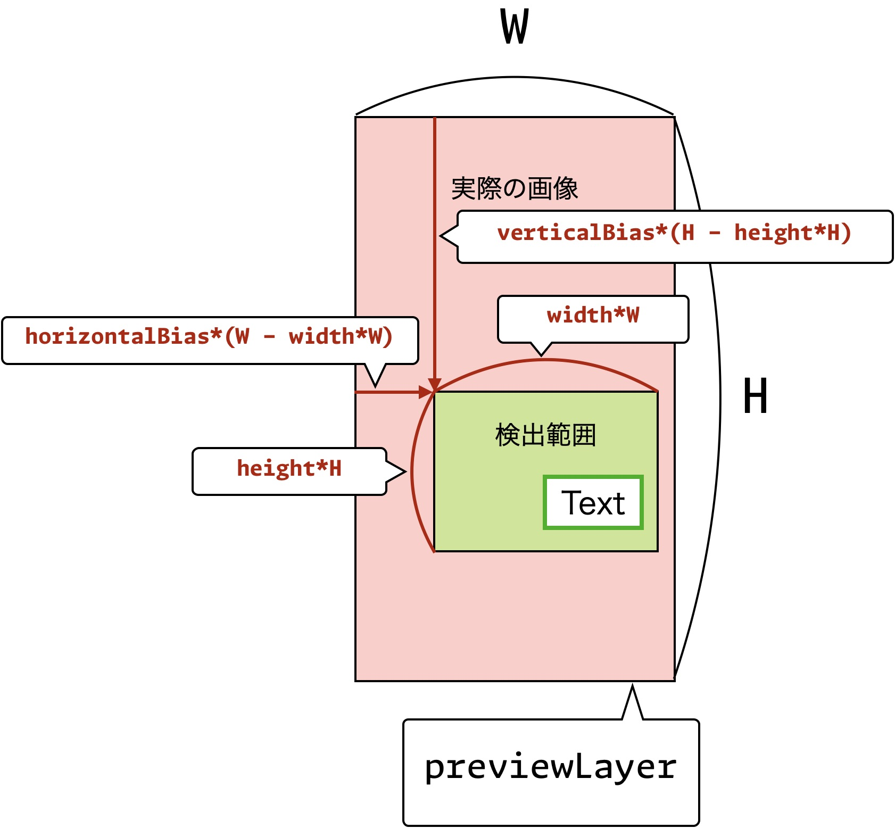
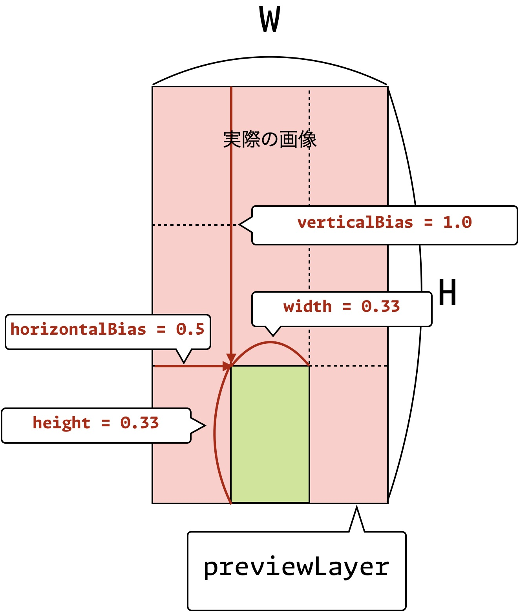

# 範囲を指定してスキャン

このチュートリアルでは，画像の中心部以外を切り取りスキャンする方法を説明いたします．


## 概要
`scanOption` の `horizontalBias`, `verticalBias`, `width`, `height` プロパティを使用して，画像の中心部以外を切り取りスキャンすることができます．
この例の実装は
`EdgeOCRSample/Views/Crop/CropViewController.swift` と
`EdgeOCRSample/Views/Crop/CropView.swift` ，
`EdgeOCRSample/Views/Main/MainView.swift`
に実装されていますので，ご参考になさってください．


## 中心以外を切り取りスキャンする実装方法
`CropViewController` において，切り取り範囲を指定したスキャンを実行しています．

切り取り範囲を指定した `scanOption` を `scan` メソッドに渡すことで，指定した範囲の画像をスキャンすることができます．

```swift
// MARK: - scanOptionを指定して，OCRを実行

scanResult = try edgeOCR.scan(
    sampleBuffer,
    scanOption: scanOption,
    viewBounds: viewBounds)
```

`scanOption` の `horizontalBias`, `verticalBias`, `width`, `height` プロパティを設定することで，画像の中心部以外を切り取りスキャンすることができます．



`horizontalBias`, `verticalBias`, `width`, `height` と実際の画像の関係性を図で示すと上記のようになります．
- `cropWidth` は 切り取る幅を指定します．
- `height` は 切り取る高さを指定します．
- `horizontalBias` は 全体から切り取る範囲の横幅を除いた残りからのX座標の開始位置を指定します．
- `verticalBias` は 全体から切り取る範囲の高さを除いた残りからのY座標の開始位置を指定します．

`horizontalBias` と `verticalBias` は画像の左上を原点として横方向と縦方向の位置を0.0から1.0の範囲で指定します．
`cropWidth` と `height` は，入力画像の元々の幅と高さを 1 として，切り取る範囲を画像の幅と高さをそれぞれ0.0から1.0の範囲で指定します．




例えば，図のように画面を9等分して，最下段の真ん中のみを切り取りたい場合は以下のように，`horizontalBias`, `verticalBias`, `cropWidth`, `height` を設定します．
```swift
scanOptions = ScanOptions(
    scanMode: ScanOptions.ScanMode.Default,
    cropRect: CropRect(
        horizontalBias: 0.5,
        verticalBias: 1.0,
        cropWidth: 0.33,
        height: 0.33))
```


## 次のステップ
次はテキスト範囲の検出時にフィルタを行う方法を説明します．

↪️ [テキスト範囲の検出時にフィルタを行う](09-detection-filter.md)
