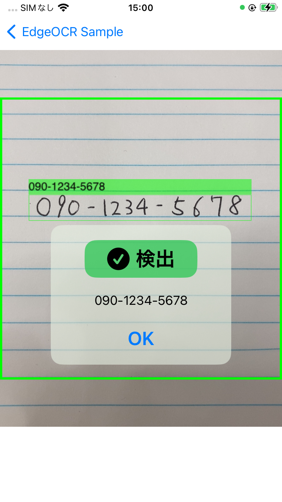

# マスターデータを用いたOCR (完全一致)

このチュートリアルでは，OCR 検出結果がマスターデータ（ホワイトリスト）に含まれているテキストを検出した際に，ダイアログを表示する方法を説明いたします．





## 概要
検出したいマスターデータをあらかじめ定義し，検出結果のテキストがマスターデータに含まれているかどうかを判定します．
そして，マスターデータに含まれているテキストを検出した場合には，ダイアログを表示します．

この例の実装は，
`EdgeOCRSample/Views/WhiteList/WhiteListViewController.swift` と
`EdgeOCRSample/Views/WhiteList/WhiteListView.swift`，
`EdgeOCRSample/Views/WhiteList/WhiteListAnalyzer.swift`，
`EdgeOCRSample/Views/Main/MainView.swift`，
に実装されていますので，ご参考になさってください．


## マスターデータを用いたOCR（完全一致）の実装方法
`EdgeOCRSample/Views/WhiteList/WhiteListAnalyzer.swift` に実装されている `WhiteListAnalyzer` クラスを使用して，検出結果とマスターデータの比較を行います．

マスターデータに含まれている `Text` は `targetDetections` に，含まれていない `Text` は `notTargetDetections` に格納します．

```swift
class AnalyzerResult {
    let targetDetections: [Text]
    let notTargetDetections: [Text]

    init(targetDetections: [Text], notTargetDetections: [Text]) {
        self.targetDetections = targetDetections
        self.notTargetDetections = notTargetDetections
    }

    func getTargetDetections() -> [Text] {
        return targetDetections
    }

    func getNotTargetDetections() -> [Text] {
        return notTargetDetections
    }
}

class WhiteListAnalyzer {
    let whiteList: Set = [
        "090-1234-5678",
        "090-0000-1234",
        "090-2222-3456",
        "090-4444-5555",
        "090-6666-7777",
        "090-8888-9999",
    ]

    init() {}

    func analyze(_ detections: [Text]) -> AnalyzerResult {
        var targetDetections: [Text] = []
        var notTargetDetections: [Text] = []

        for detection in detections {
            let text = detection.getText()
            // マスターデータ（ホワイトリスト）に含まれているかどうかを判定
            if whiteList.contains(text) {
                targetDetections.append(detection)
            } else {
                notTargetDetections.append(detection)
            }
        }

        return AnalyzerResult(
            targetDetections: targetDetections,
            notTargetDetections: notTargetDetections)
    }
}
```


次に，`EdgeOCRSample/Views/WhiteList/WhiteListViewController.swift` では，`WhiteListAnalyzer` クラスを使用して，検出結果とマスターデータの比較を行います．

`targetDetection` はマスターデータに含まれているテキストを，`notTargetDetection` はマスターデータに含まれていないテキストを表します．

`targetDetection` は緑色の枠で，`notTargetDetection` は赤色の枠で表示されます．

```swift
func drawDetections(result: ScanResult) {
    CATransaction.begin()
    CATransaction.setValue(kCFBooleanTrue, forKey: kCATransactionDisableActions)
    detectionLayer.sublayers = nil

    // MARK: - マスターデータ（ホワイトリスト）に検出結果が含まれているかを判定

    let detections = result.getTextDetections()
    let analyzerResult = analyzer.analyze(detections)
    var messages: [String] = []
    for targetDetection in analyzerResult.getTargetDetections() {
        let text = targetDetection.getText()
        let bbox = targetDetection.getBoundingBox()
        drawDetection(bbox: bbox, text: text)
        messages.append(text)
    }

    for notTargetDetection in analyzerResult.getNotTargetDetections() {
        let text = notTargetDetection.getText()
        let bbox = notTargetDetection.getBoundingBox()
        drawDetection(bbox: bbox, text: text, boxColor: UIColor.red.withAlphaComponent(0.5).cgColor)
    }

    if messages.count > 0 {
        showDialog = true
        self.messages = messages
    }
    CATransaction.commit()
}
```

## 次のステップ
次はマスターデータを用いたOCRで曖昧さを許容したOCR方法を説明します．

↪️ [マスターデータを用いたOCR (曖昧一致)](14-editdistance.md)
